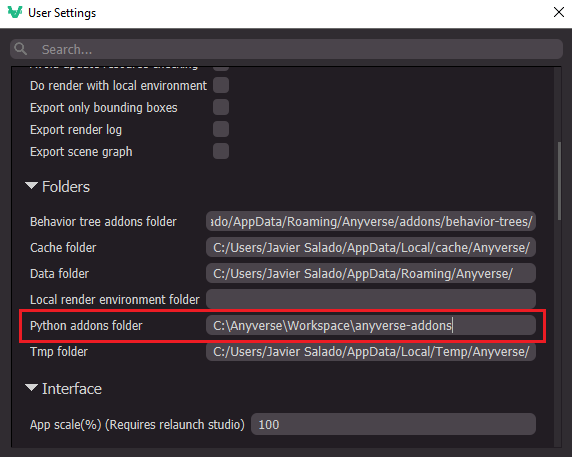
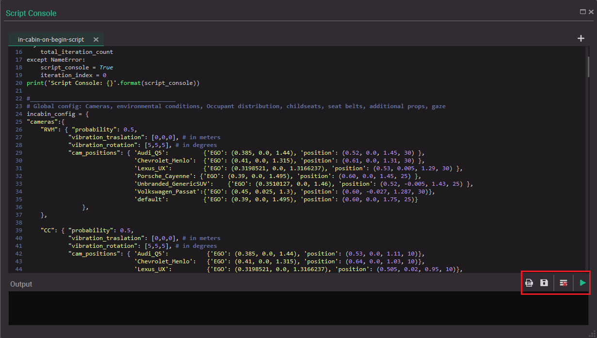
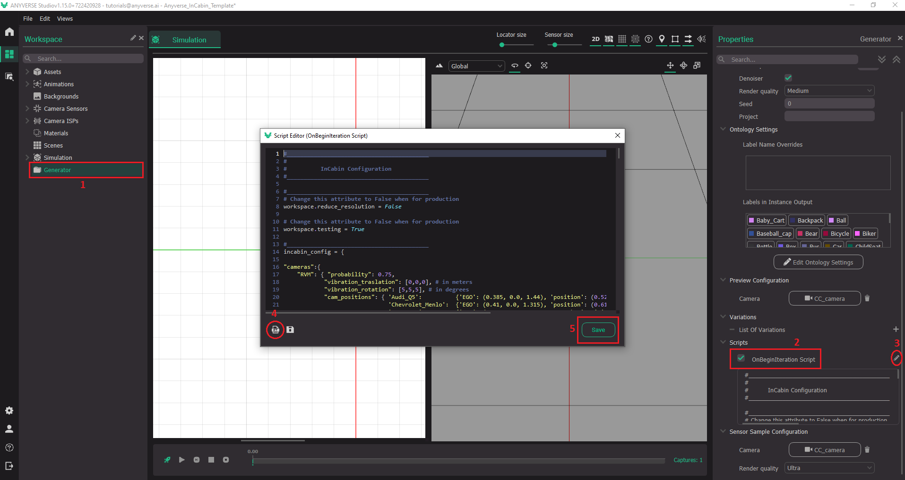

# Anyverse In-Cabin Add-on
This repo has all the necessary python modules and scripts to generate dataset for an in-cabin use case with the [Anyverse Platform](https:anyverse.ai)

## Getting started
To this Anyverse add-on (or any other Anyverse add-on for that matter) you need:

1. An Anyverse Platform account
2. Anyverse Studio installed on your local machine

Clone this repo to your local machine, or if you want to contribute, fork the repo to your github account (you will be able to send pull requests with your contributions) and then clone it to your local machine.

## Configure Anyverse Studio the use the add-on
In Anyverse Studio User Settings, set the 'Python addons folder'  to your local repo directory.



## Add-on structure
This add-on has an incabin module and an on-begin-iteration script :

- **incabin.py** - Incabin module with the InCabinUtils class that implements all the functionality you need to generate an in-cabin dataset. The class is used in the on-begin-iteration script.
- **variation-scripts/in-cabin-on-begin-script.py** - Script to use in the generation On Begin Script property. This has all the in-cabin configuration and logic to select a car cabin, camera, environmental conditions and occupancy distribution, including seat belts, and gaze probabilities.

## Using the add-on
The in-cabin add-on allows to generate a varied in-cabin dataset to train and validate different in-cabin monitoring use cases.

As is, the add-on allows to generate static images datasets at scale manipulating the variability with the configuration dictionaries at the beginning of the on-begin-iteration script.

From Anyverse Studio you can test the set up and the on-begin-iteration script using the script console. From the Workspace perspective, open the script console selecting 'Show script console view' from the Views pull down menu.



Use the  to load the on-begin-script in the console and the  to run the script and see the effects in the 3D viewer and the workspace.

Feel free to change the script configuration if you want to change the behavior of the dataset generation. 

To generate a dataset based on that configuration, import the on-begin-iteration script in the Generator OnBeginIteration property:



Configure the number of iterations property to generate the samples ina  dataset.

Check the tutorials for a step-by-step explanation of the process.

## In-cabin variability configuration
At the beginning of the on-begin-iteration script we define the **`incabin_config`** dictionary with all the variables you can use to configure the variability of the resulting dataset. It has 4 configuration properties: `cameras`, `conditions`, `occupant_confs_probabilities` and `occupancy_distribution`.

The first property, `cameras` allow you to configure as many cameras you want in the cabin. You can set the probability[^probabilities] for the correspondent camera to be used in the dataset, a couple of vibration vectors move the camera using a normal or uniform distribution around its initial position and orientation and the initial position and pitch angle for every car cabin model. This is the default configuration for 2 cameras RVM for a rear view mirror position and CC for central console position:

```
"cameras":{
    "RVM": { "probability": 0.75,
            "vibration_traslation": [0,0,0], # in meters
            "vibration_rotation": [5,5,5], # in degrees
            "cam_positions": { 'Audi_Q5':          {'EGO': (0.385, 0.0, 1.44), 'position': (0.52, 0.0, 1.45, 30) }, 
                               'Chevrolet_Menlo':  {'EGO': (0.41, 0.0, 1.315), 'position': (0.61, 0.0, 1.31, 30) },
                               'Lexus_UX':         {'EGO': (0.3198521, 0.0, 1.3166237), 'position': (0.53, 0.005, 1.29, 30) },
                               'Porsche_Cayenne': {'EGO': (0.39, 0.0, 1.495), 'position': (0.60, 0.0, 1.45, 25) },
                               'Unbranded_GenericSUV':    {'EGO': (0.3510127, 0.0, 1.46), 'position': (0.52, -0.005, 1.43, 25) },
                               'Volkswagen_Passat':{'EGO': (0.45, 0.025, 1.3), 'position': (0.60, -0.027, 1.287, 30)},
                               'default':          {'EGO': (0.39, 0.0, 1.495), 'position': (0.60, 0.0, 1.75, 25)}
                },
    },    
    "CC": { "probability": 0.25,
            "vibration_traslation": [0,0,0], # in meters
            "vibration_rotation": [5,5,5], # in degrees
            "cam_positions": { 'Audi_Q5':           {'EGO': (0.385, 0.0, 1.44), 'position': (0.53, 0.0, 1.11, 10)}, 
                               'Chevrolet_Menlo':   {'EGO': (0.41, 0.0, 1.315), 'position': (0.64, 0.0, 1.03, 10)},
                               'Lexus_UX':          {'EGO': (0.3198521, 0.0, 1.3166237), 'position': (0.505, 0.02, 0.95, 10)},
                               'Porsche_Cayenne':  {'EGO': (0.39, 0.0, 1.495), 'position': (0.60, 0.0, 1.165, 10)},
                               'Unbranded_GenericSUV':     {'EGO': (0.3510127, 0.0, 1.46), 'position': (0.58, 0.005, 1.085, 10)},
                               'Volkswagen_Passat': {'EGO': (0.45, 0.025, 1.3), 'position': (0.70, 0.027, 1.00, 10)},
                               'default':           {'EGO': (0.39, 0.0, 1.495), 'position': (0.60, 0.0, 1.75, 25)}
                },
    }
},
```
The `conditions`property has to do with the illumination. You can set the probabilities for 4 different  conditions. the last one `interior-lights` sets a night time[^times] and enables in-cabin active illumination and NIR simulation. The default configuration is:

```
"conditions": [{'Day': True,  'Cond':'sunny',          'Probability': 0.25},
             {'Day': True,  'Cond':'scattered',      'Probability': 0.25},
             {'Day': True,  'Cond':'overcast',       'Probability': 0.25},
             {'Day': False, 'Cond':'interior-lights','Probability': 0.25}],
```

IF you need empty cabins with no occupants nor objects in you dataset, you can control this with the `occupant_confs_probabilities` property. It allows you to force a percent of samples with completely empty seats instead of relying in the statistical probability of a random empty seats configuration. This is the default:

```
"occupant_confs_probabilities": [ {'Conf': 'Empty', 'Probability': 0.0},
                                {'Conf': 'Normal', 'Probability': 1.0}],
```

The `occupancy_distribution` property is the most complex and allows you to control how every seat is occupied, what you want to do with the seat belts, if you want to place additional accessories to the characters and where are the characters looking at. 

For the driver seat, you can set the probabilities to be empty or occupied. For all other seats you can set probabilities to be empty, have a child seat, a passenger or an object. You have control on the probabilities for different types of child seats as well.

For seat belts, on one hand, you can decide the probability that a given passenger (including children in child seats) have a seat belt on. The how is that seat belt placed, normal or with a wrong placement.

Finally for the driver and the copilot, you can control their gaze setting the probabilities they are going to look at: the road, the exterior rear view mirrors, the interior rear view mirror the other front row passenger or at the rear passengers. This is the default configuration for all the above:

```
"occupancy_distribution": { 'driver_occupancy_probabilities': [ {'name': 'Empty',  'occupancy': 0, 'probability': 0.15},
                                                              {'name': 'Driver', 'occupancy': 1, 'probability': 0.85} ],
                                                              
                          'copilot_occupancy_probabilities': [ {'name': 'Empty',     'occupancy': 0, 'probability': 0.25},
                                                               {'name': 'ChildSeat', 'occupancy': 2, 'probability': 0.25},
                                                               {'name': 'Passenger', 'occupancy': 3, 'probability': 0.25},
                                                               {'name': 'Object',    'occupancy': 4, 'probability': 0.25} ],
                                                               
                          'backseat_occupancy_probabilities': [ {'name': 'Empty',     'occupancy': 0, 'probability': 0.25},
                                                                {'name': 'ChildSeat', 'occupancy': 2, 'probability': 0.25},
                                                                {'name': 'Passenger', 'occupancy': 3, 'probability': 0.25},
                                                                {'name': 'Object',    'occupancy': 4, 'probability': 0.25} ],
                                                                
                          'middleseat_occupancy_probabilities': [ {'name': 'Empty',     'occupancy': 0, 'probability': 0.25},
                                                                  {'name': 'ChildSeat', 'occupancy': 2, 'probability': 0.25},
                                                                  {'name': 'Passenger', 'occupancy': 3, 'probability': 0.25},
                                                                  {'name': 'Object',    'occupancy': 4, 'probability': 0.25} ],
                          'childseat_type_probabilities': [ {'Type': 'BabyChild',   'Probability': 0.3},
                                                            {'Type': 'Convertible', 'Probability': 0.3},
                                                            {'Type': 'Booster',     'Probability': 0.3}],
                          'childseat_occupied_probability':  0.3,
                          'accessories_probabilities': {'global': 0.5, 'glasses': 0.5, 'headwear': 0.5, 'mask': 0.5 },
                          
                          "seatbelts_distribution": {
                                'belt_on_probability': 0.95, # Probability for seatbelt on when there is a character seatted on
                                'seatbelt_placement_probabilites': {
                                       'Normal': 0.80,
                                       'BehindTheBack': 0.05,
                                       'UnderShoulder': 0.05,
                                       'WrongSideOfHead': 0.05,
                                       'CharacterOverSeatbelt': 0.05
                                },   
                                'belt_on_without_character_probability': 0.2, # Probability for seatbelt on when the seat is empty
                            },
                           'gaze_probabilities': {
                                'driver_gaze_probabilities':  [ {'name': 'road', 'gaze': 0, 'probability': 0.7},
                                                                {'name': 'ext_mirror', 'gaze': 1, 'probability': 0.1},
                                                                {'name': 'int_mirror', 'gaze': 2, 'probability': 0.05},
                                                                {'name': 'infotainment', 'gaze': 3, 'probability': 0.05},
                                                                {'name': 'passenger', 'gaze': 4, 'probability': 0.1},
                                                                {'name': 'rear', 'gaze': 5, 'probability': 0.0}],
                                'copilot_gaze_probabilities': [ {'name': 'road', 'gaze': 0, 'probability': 0.50},
                                                                {'name': 'ext_mirror', 'gaze': 1, 'probability': 0.05},
                                                                {'name': 'int_mirror', 'gaze': 2, 'probability': 0.1},
                                                                {'name': 'infotainment', 'gaze': 3, 'probability': 0.1},
                                                                {'name': 'passenger', 'gaze': 4, 'probability': 0.2},
                                                                {'name': 'rear', 'gaze': 5, 'probability': 0.05}]
                           }
                        }
}
```


[^probabilities]: they represent the percentage of samples that will have the correspondent characteristic. 0 is 0% and 1  is 100%.

[^times]: We are assuming an equator location. Day time is between 6 AM to 6 PM and night time the other half of the day.

